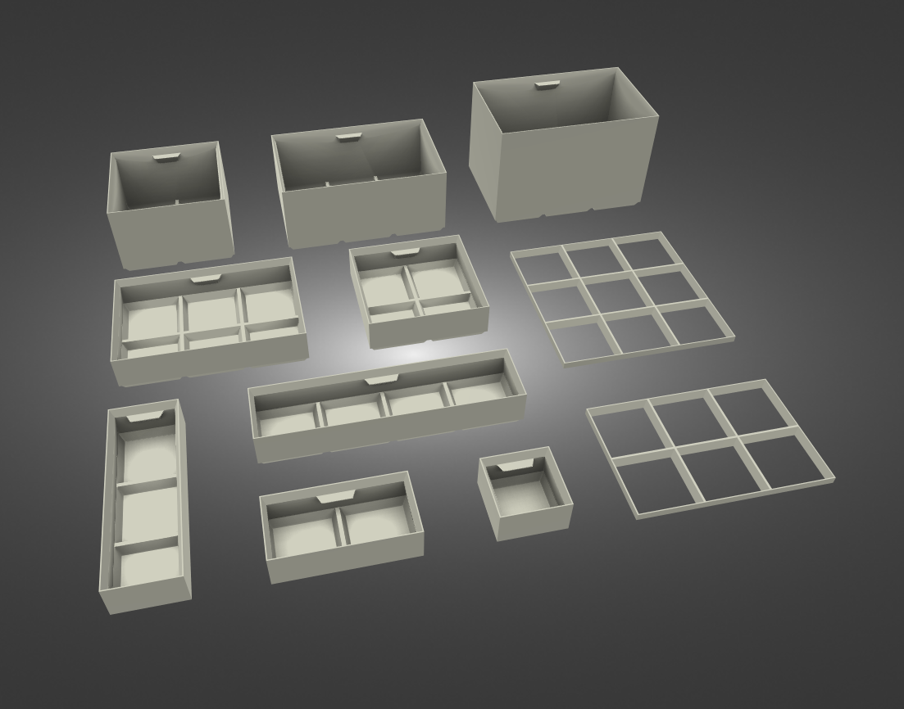
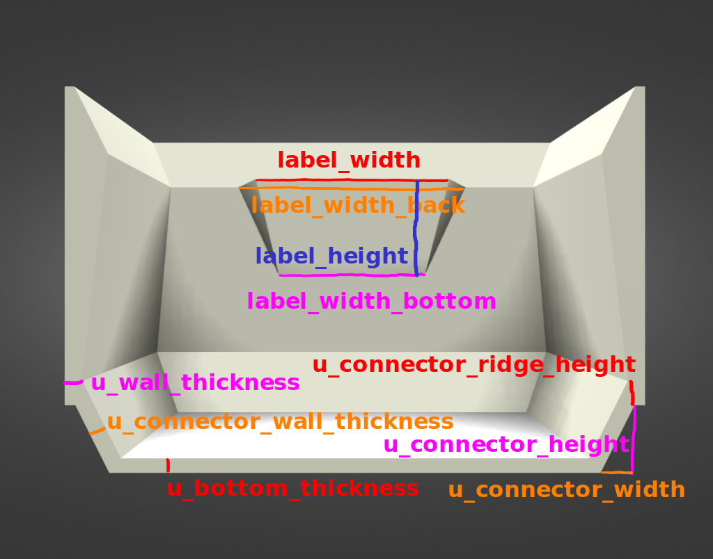
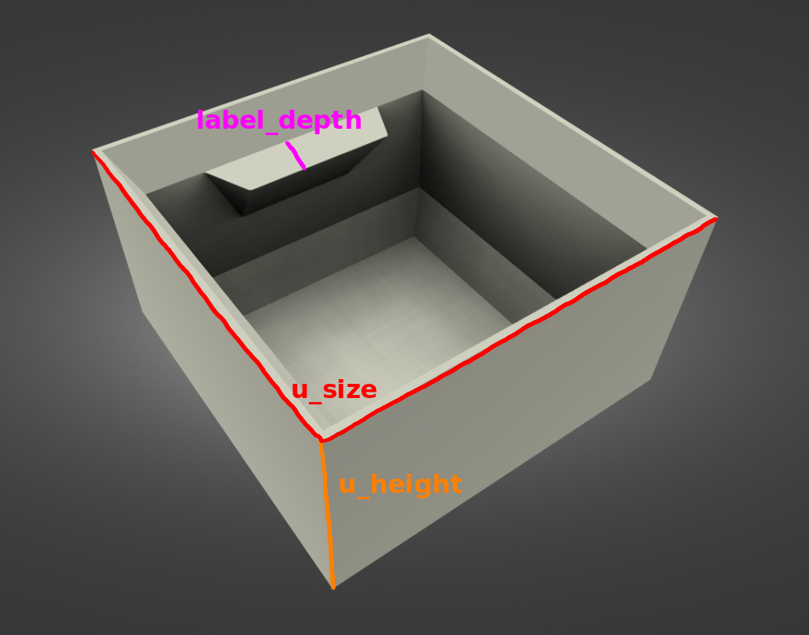

# ElectronicsOrganizer

## An in OpenSCAD designed electronics organizing grid-box system.

You can export a box of any size. All boxes are stackable.

The outer size of a box in x/y is always a multiple of the size of the base
unit (1x1x1). For the height you need the following formula (due to the
stacking-mechanism):

```
total_height = <h>*<u_height> - (<h> - 1) * <u_connector_height>
```

with `<h>` as the height multiplier.




### File naming

#### Box

The boxes are located in `stl files/box/height <height>` with `<height>` as the
unit-height of the box.

The files are named `box_<size_a>x<size_b>x<height>.stl`.

#### Mesh

The meshes are located in `stl files/mesh/<type>` with type as one of the
following:

- `chamfer 1`: The mesh has a chamfer on one side.
- `chamfer 2`: The mesh has a chamfer on two sides.
- `chamfer 4`: The mesh has a chamfer on four sides.
- `normal`: The mesh has no chamfer.

The files are named `mesh_<size_a>x<size_b>_chamfer_<sides>` with `<sides>` as
the following:

- `l`: The mesh has a chamfer on the left side (looking from the top down).
- `t`: The mesh has a chamfer on the top side (looking from the top down).
- `r`: The mesh has a chamfer on the right side (looking from the top down).
- `b`: The mesh has a chamfer on the bottom side (looking from the top down).

`l`, `t`, `r` and `b` can be combined to `l+t`, `l+r`, etc.

### Modifying the box-dimensions

The following two images show every parameter that can be changed in
`dimensions.scad`.





### Attribution

The design was inspired by the
[assortment boxes](https://www.youtube.com/watch?v=adi_tjCwbUw) from
Alexandre Chappel.

The renders were created with the
[Free STL viewer tool](https://stl-viewer.dualbox.com/) from Dualbox.